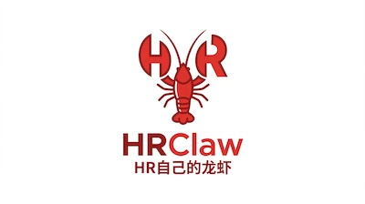

<p align="center">
  
</p>

# HRClaw JD Scorecard Skill

<p align="center">Turn job descriptions and PDF resumes into recruiter-ready decisions.</p>
<p align="center">把 JD 和 PDF 简历变成可执行的招聘结论。</p>

<p align="center">
  
  
  
</p>

<p align="center">
  <a href="mailto:hrclaw@126.com">Email: hrclaw@126.com</a> ·
  <a href="README.zh-CN.md">中文首页</a> ·
  Open Issues: `Demo request` / `中文 demo 预约`
</p>


> One skill, three jobs: turn a JD into a scorecard, score a PDF resume against that scorecard, and render a Feishu/DingTalk-friendly chat view when recruiters want something they can paste into a team channel.

## Best For

- Recruiting teams screening high-volume JD and resume traffic
- Teams that want one scoring standard instead of ad hoc judgment
- Feishu / DingTalk heavy ops workflows
- Product, HR, and hiring manager collaboration

## What It Does

- `JD -> scorecard`
- `PDF resume -> score against scorecard`
- `JSON -> automation`
- `Markdown -> human review`
- `Chat markdown -> Feishu / DingTalk`

## Output Modes

| Mode | Best for | Example output |
| --- | --- | --- |
| Pure JSON | Integrations and downstream parsing | `skills/jd-scorecard/templates/scorecard.json` |
| Human-readable Markdown | Recruiter review and team calibration | `skills/jd-scorecard/templates/scorecard.md` |
| Chat-friendly Markdown | Feishu, DingTalk, Slack, Teams | `skills/jd-scorecard/templates/chat-scorecard.md` |

## Try It

Paste one of these:

```text
把这段 JD 转成招聘评分卡，输出纯 JSON
用这份 PDF 简历按下面评分卡打分，输出纯 JSON
用飞书版输出这份评分卡
```

If you are scoring a resume, give the skill both the resume and the scorecard or JD.
If the PDF has no text layer, the flow will mark it as `needs_ocr` instead of guessing.

## What You Get

- Clear hard filters for fast screening
- Must-have and nice-to-have signals
- Interview questions that test real work
- Red flags that help recruiters reject quickly
- Resume scoring with evidence, matched terms, and next steps
- Chat-ready output for the tools teams already use

## Install For Local Codex Use

```bash
cp -R skills/jd-scorecard ~/.codex/skills/
```

Then restart Codex so the skill is loaded.

## Open vs Private

| Open source skill | Private product |
| --- | --- |
| JD scoring | BOSS integration |
| Resume scoring | Team calibration |
| Chat-friendly markdown | Workflow automation |
| Examples and templates | Internal deployment and support |

The public repo stays text-first, portable, and easy to inspect.
The private version adds the workflow depth and integrations needed for live hiring ops.

## Repository Map

- [Skill definition](skills/jd-scorecard/SKILL.md)
- [JD prompt](skills/jd-scorecard/prompts/jd-to-scorecard.md)
- [Resume prompt](skills/jd-scorecard/prompts/resume-score.md)
- [Skill references](skills/jd-scorecard/references/)
- [Chat scorecard template](skills/jd-scorecard/templates/chat-scorecard.md)
- [Chat resume template](skills/jd-scorecard/templates/chat-resume-score.md)
- [Examples](skills/jd-scorecard/examples/)
- [Validation workflow](.github/workflows/validate-skill.yml)

## Skill References

- [Chinese homepage](README.zh-CN.md)
- [Chinese deployment guide](docs/中文说明书-部署与使用.md)
- [Intranet deployment checklist](docs/内网部署实施清单.md)
- [Quickstart](skills/jd-scorecard/references/quickstart.md)
- [FAQ](skills/jd-scorecard/references/faq.md)
- [Limitations](skills/jd-scorecard/references/limitations.md)

## Contact

- Email: [hrclaw@126.com](mailto:hrclaw@126.com)
- GitHub Issues: open the Issues tab and choose `Demo request` or `中文 demo 预约`

## License

MIT
