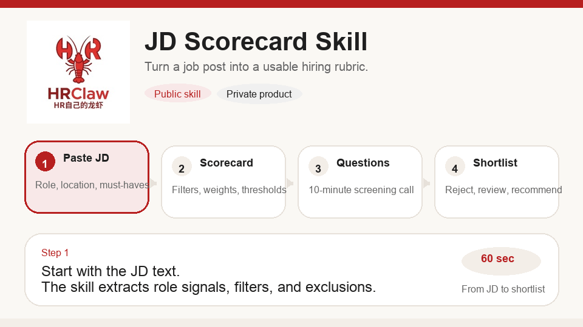

<p align="center">
  
</p>

# HRClaw

<p align="center">Local-first recruiting copilot for JD scorecards, batch resume scoring, browser capture, and recruiter-ready output.</p>
<p align="center">把 JD、PDF 简历和浏览器候选人页，变成招聘团队能直接执行的筛选结论。</p>

<p align="center">
  
  
  
  
</p>

<p align="center">
  <a href="mailto:hrclaw@126.com">Email</a> ·
  <a href="README.zh-CN.md">中文说明</a> ·
  Issues: <code>Demo request</code> / <code>中文 demo 预约</code>
</p>



> HRClaw is an open-source recruiting workflow that combines a JD scorecard skill, batch resume scoring, a recruiter admin console, and a Chrome side-panel capture layer. It is designed for teams that want a usable screening standard before they buy or build a full ATS.

## Why HRClaw

- Convert a JD into a reusable screening scorecard in minutes
- Score PDF or Word resumes with evidence, thresholds, and interview questions
- Capture candidate detail pages from the browser into the same scoring backend
- Render recruiter-friendly results for Feishu, DingTalk, Slack, or Teams
- Keep the workflow local-first so teams can test quickly without exposing candidate data to multiple SaaS tools

## What Ships In This Repo

| Surface | What it does | Where it lives |
| --- | --- | --- |
| `jd-scorecard` skill | JD to scorecard, resume scoring, chat rendering | `skills/jd-scorecard/` |
| Recruiter admin console | Trial hub, JD cards, batch imports, workbench views | `admin_frontend/` + `src/screening/api.py` |
| Batch import pipeline | PDF / DOC / DOCX parsing, OCR fallback, scoring | `src/screening/phase2_imports.py` |
| Browser capture plugin | Chrome MV3 side panel for candidate page capture | `chrome_extensions/boss_resume_score/` |
| Local install bundles | Frontend dist, plugin zip, Windows/macOS-friendly package assets | `install/` + `release/` |

## Core Workflow

1. Create a scorecard from a JD
2. Import a batch of resumes and score them against that scorecard
3. Capture candidate detail pages from the browser when recruiters prefer in-page review
4. Share the result as JSON, Markdown, or Feishu / DingTalk-friendly chat text
5. Review and calibrate the scoring standard with HR and hiring managers

## Product Highlights

### 1. JD Scorecards

- Hard filters, must-have signals, nice-to-have signals
- Interview questions and red flags generated from the JD
- Reusable templates for QA, Python, caption, and custom roles

### 2. Batch Resume Scoring

- Import PDF / DOC / DOCX in one batch
- Structured candidate profile extraction
- Recommend / review / reject decisions with evidence
- OCR fallback path for scanned PDFs

### 3. Browser Capture

- Chrome MV3 side panel workflow
- Reads the candidate page the recruiter is already viewing
- Sends the snapshot into the same scoring backend
- Keeps workbench and manual HR follow-up aligned

### 4. Recruiter-Ready Output

- Pure JSON for integrations and automation
- Markdown for HR and hiring manager review
- Feishu / DingTalk output for fast team sharing

## Best For

- Recruiting teams handling repeated hiring for the same role family
- HR teams that need one screening standard instead of ad hoc judgment
- Teams collaborating in Feishu or DingTalk
- Pilot projects where speed, clarity, and local deployment matter more than a full ATS rollout

## Quick Start

### Run the local app

```bash
bash scripts/start_phase1_server.sh
```

Open:

- `http://127.0.0.1:8080/login`
- default account: `admin / admin`

### Install the skill into Codex

```bash
cp -R skills/jd-scorecard ~/.codex/skills/
```

Then restart Codex.

### Load the browser plugin

Open Chrome extensions and load:

```text
chrome_extensions/boss_resume_score
```

Then point the plugin to:

```text
http://127.0.0.1:8080
```

## Release Assets In This Version

- `install/packages/frontend/admin_frontend-dist.tgz`
- `install/packages/windows/admin_frontend-dist.zip`
- `install/packages/macos/.env.local.example`
- `install/packages/chrome_extension/boss_resume_score.zip`
- `release/HRClaw_windows_bundle.zip`
- `release/HRClaw_macos_bundle.zip`

These are refreshed so the packaged assets match the current admin console and browser capture layer.

## Open Source vs Private Deployment

| Open source in this repo | Private deployment / service |
| --- | --- |
| JD scorecards and resume scoring | Workflow customization |
| Recruiter admin console | Team calibration and rollout support |
| Browser capture plugin | Internal deployment assistance |
| Local install assets | Enterprise process adaptation |
| Examples and templates | Change management for real hiring teams |

## Repository Map

- [Chinese README](README.zh-CN.md)
- [Skill definition](skills/jd-scorecard/SKILL.md)
- [JD prompt](skills/jd-scorecard/prompts/jd-to-scorecard.md)
- [Resume scoring prompt](skills/jd-scorecard/prompts/resume-score.md)
- [Chat scorecard template](skills/jd-scorecard/templates/chat-scorecard.md)
- [Chat resume template](skills/jd-scorecard/templates/chat-resume-score.md)
- [MVP checklist](docs/HRClaw_MVP执行清单.md)
- [Pilot SOP](docs/HRClaw_试点SOP.md)
- [Chinese deployment guide](docs/中文说明书-部署与使用.md)
- [Intranet deployment checklist](docs/内网部署实施清单.md)
- [Browser capture plugin guide](chrome_extensions/boss_resume_score/README.md)
- [Install directory guide](install/README.md)

## Contact

- Email: [hrclaw@126.com](mailto:hrclaw@126.com)
- GitHub Issues: open the Issues tab and choose `Demo request` or `中文 demo 预约`

## License

MIT
