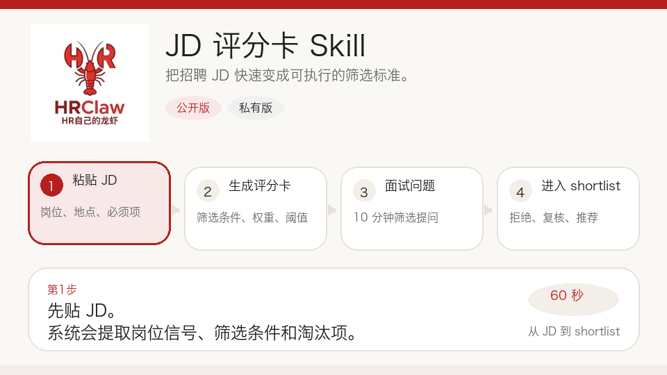

<p align="center">
  
</p>

# HRClaw

<p align="center">面向招聘团队的本地优先智能筛选工作流。</p>
<p align="center">把 JD、PDF 简历和浏览器里的候选人页面，变成能直接执行的招聘结论。</p>

<p align="center">
  
  
  
  
</p>

<p align="center">
  <a href="mailto:hrclaw@126.com">联系邮箱</a> ·
  <a href="README.md">English README</a> ·
  Issues：<code>中文 demo 预约</code> / <code>Demo request</code>
</p>



> HRClaw 不是一个“大而全 ATS”，而是一套让 HR 先跑通招聘初筛闭环的开源工作流：JD 评分卡、批量简历打分、后台管理台，以及浏览器侧边栏采集，共用同一套评分引擎。

## 为什么是 HRClaw

- 把 JD 快速变成统一的筛选标准
- 批量解析 PDF / Word 简历并给出推荐、复核、拒绝结果
- 在浏览器里直接采集候选人详情页，减少复制粘贴
- 输出适合飞书 / 钉钉群聊转发的结果
- 以本地部署为主，方便试点，降低数据外流和流程改造成本

## 这个仓库包含什么

| 模块 | 作用 | 目录 |
| --- | --- | --- |
| `jd-scorecard` skill | JD 转评分卡、简历打分、聊天版输出 | `skills/jd-scorecard/` |
| 招聘后台 | 试点中心、JD 卡、批量导入、结果查看 | `admin_frontend/` + `src/screening/api.py` |
| 批量导入链路 | PDF / DOC / DOCX 解析、OCR fallback、自动评分 | `src/screening/phase2_imports.py` |
| 浏览器采集插件 | Chrome MV3 侧边栏采集候选人详情页 | `chrome_extensions/boss_resume_score/` |
| 安装与发布包 | 前端静态产物、插件压缩包、Windows 安装附件 | `install/` + `release/` |

## 核心工作流

1. 用 JD 生成评分卡
2. 批量导入简历并按评分卡打分
3. 在浏览器中采集候选人详情页并进入同一套评分后端
4. 结果输出成 JSON、Markdown、飞书 / 钉钉版
5. HR 和用人经理据此复核、校准标准

## 产品亮点

### 1. JD 评分卡

- 自动生成硬筛条件、必备项、加分项
- 自动生成面试题和红旗信号
- 支持 QA、Python、caption 等角色模板

### 2. 批量简历打分

- 支持 PDF / DOC / DOCX 一次性导入
- 抽取结构化候选人画像
- 给出 recommend / review / reject 和证据
- 扫描版 PDF 支持 OCR fallback

### 3. 浏览器采集

- Chrome MV3 侧边栏工作流
- 读取招聘同事已经打开的候选人详情页
- 页面快照进入同一套评分引擎
- 和后台工作台、人工跟进状态保持一致

### 4. 招聘协作输出

- 纯 JSON：方便系统接入和自动化
- 普通 Markdown：方便 HR 和用人经理查看
- 飞书 / 钉钉版：方便群聊直接转发

## 最适合谁

- 同一类岗位反复招聘的团队
- 想统一筛选口径、减少主观判断的 HR 团队
- 飞书 / 钉钉协作频繁的招聘流程
- 想先低成本验证产品价值，再决定是否上 ATS 的团队

## 快速开始

### 启动本地服务

```bash
bash scripts/start_phase1_server.sh
```

打开：

- `http://127.0.0.1:8080/login`
- 默认账号：`admin / admin`

### 安装 Codex skill

```bash
cp -R skills/jd-scorecard ~/.codex/skills/
```

然后重启 Codex。

### 加载浏览器插件

在 Chrome 扩展程序中加载：

```text
chrome_extensions/boss_resume_score
```

然后把插件后端地址设置为：

```text
http://127.0.0.1:8080
```

## 这个版本已经打包好的发布物

- `install/packages/frontend/admin_frontend-dist.tgz`
- `install/packages/windows/admin_frontend-dist.zip`
- `install/packages/chrome_extension/boss_resume_score.zip`
- `release/HRClaw_windows_bundle.zip`

这些包已经和当前后台页面、插件侧边栏版本同步，适合直接分发和试点。

## 开源版 vs 私有交付

| 开源版 | 私有交付 / 服务 |
| --- | --- |
| JD 评分卡和简历打分 | 按团队流程定制 |
| 招聘后台和浏览器插件 | 校准、培训和落地支持 |
| 本地安装包 | 内网部署协助 |
| 示例、模板、提示词 | 真实招聘流程改造 |

## 仓库导航

- [English README](README.md)
- [Skill 定义](skills/jd-scorecard/SKILL.md)
- [JD 提示词](skills/jd-scorecard/prompts/jd-to-scorecard.md)
- [简历打分提示词](skills/jd-scorecard/prompts/resume-score.md)
- [飞书 / 钉钉评分卡模板](skills/jd-scorecard/templates/chat-scorecard.md)
- [飞书 / 钉钉简历打分模板](skills/jd-scorecard/templates/chat-resume-score.md)
- [MVP 执行清单](docs/HRClaw_MVP执行清单.md)
- [试点 SOP](docs/HRClaw_试点SOP.md)
- [中文说明书-部署与使用](docs/中文说明书-部署与使用.md)
- [内网部署实施清单](docs/内网部署实施清单.md)
- [浏览器采集插件说明](chrome_extensions/boss_resume_score/README.md)
- [install 目录说明](install/README.md)

## 联系方式

- 邮箱：[hrclaw@126.com](mailto:hrclaw@126.com)
- GitHub Issues：打开 Issues，选择 `中文 demo 预约` 或 `Demo request`

## 许可证

MIT
