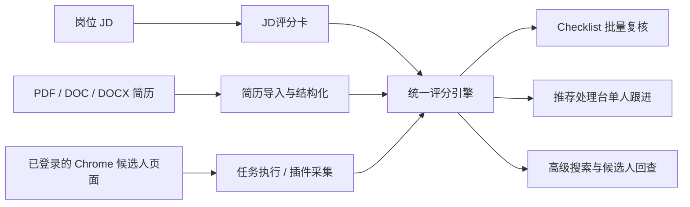
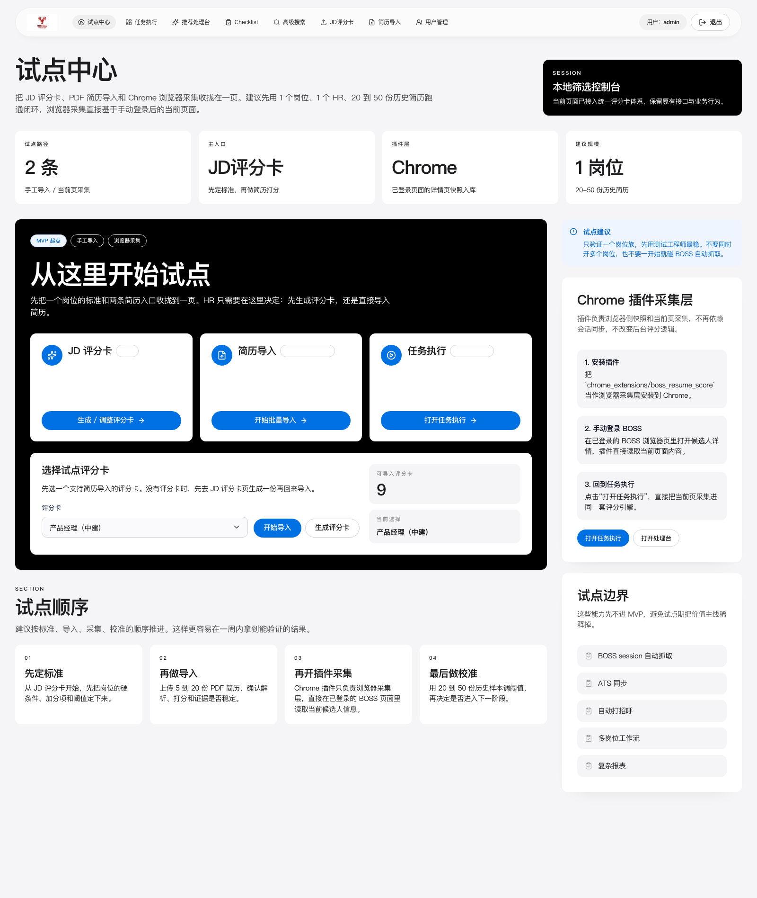

# HRClaw 功能说明书

> 版本基线：当前仓库 `v0.2.0` 能力范围  
> 文档用途：用于客户介绍、项目交付、实施培训与 HR 日常使用说明  
> 截图来源：`2026-04-21` 本地运行版本真实页面

## 1. 产品概述

HRClaw 是一套面向招聘团队的本地优先智能筛选工作流，不是传统意义上的“大而全 ATS”。它围绕招聘初筛场景，把 JD、PDF/Word 简历、浏览器中的候选人页面统一接入到同一套评分与处理后台中，帮助 HR 在较低改造成本下先跑通招聘筛选闭环。

当前版本重点解决 4 类问题：

- 把 JD 快速转成统一的筛选评分卡
- 把批量简历转成结构化候选人结果
- 把浏览器里的候选人页面直接纳入同一套评分链路
- 把结果沉淀到可复核、可检索、可跟进的后台工作台

## 2. 适用对象与使用边界

### 2.1 适用对象

- 同一类岗位长期重复招聘的 HR 团队
- 希望统一筛选口径的招聘负责人和用人经理
- 需要在飞书、钉钉、微信群等场景中快速讨论候选人的团队
- 希望先做本地试点，再逐步决定是否接入更重型 ATS 的组织

### 2.2 当前版本边界

- 以本地部署、本地试点为主
- 推荐页流程以“人工登录浏览器后执行”为主，不强调无人值守全自动抓取
- 支持 PDF / DOC / DOCX 简历导入
- 扫描版简历支持 OCR fallback，但效果受原始简历质量影响
- 当前不以云端多租户平台为目标

## 3. 系统整体能力

### 3.1 功能总览

| 模块 | 作用 | 典型使用人 |
| --- | --- | --- |
| 登录与权限 | 登录后台、区分管理员与 HR 权限 | 管理员、HR |
| 试点中心 | 提供试点入口和推荐使用顺序 | 管理员、HR |
| JD 评分卡 | 把 JD 转成结构化评分标准 | HR、用人经理 |
| 简历导入 | 批量导入 PDF/Word 简历并自动打分 | HR |
| 任务执行 | 在已登录浏览器中执行推荐牛人简历分析 | HR |
| Checklist | 批量复核候选人清单与证据 | HR、用人经理 |
| 推荐处理台 | 单个候选人的深入处理、跟进与状态维护 | HR |
| 高级搜索 | 基于结构化条件搜索本地候选人库 | HR、招聘负责人 |
| 用户管理 | 创建后台账号、权限与启停管理 | 管理员 |
| Chrome 插件 | 浏览器侧候选人详情采集与侧边栏评分 | HR |
| `jd-scorecard` Skill | 在 Codex / ClawHub 中把 JD 与简历转换成结构化输出 | HR、项目实施人员 |

### 3.2 统一工作流

## 4. 输入与输出

### 4.1 主要输入

- 岗位 JD 文本
- PDF / DOC / DOCX 简历文件
- 浏览器当前候选人详情页内容
- HR 手工维护的状态、备注、跟进时间、复核结论

### 4.2 主要输出

- 结构化 JD 评分卡
- 批量简历评分结果
- recommend / review / reject 结论
- 关键词命中项、缺失项、证据摘要
- 完整简历截图、完整 Markdown 简历、详情 JSON
- 可在后台继续维护的招聘跟进记录

## 5. 页面与模块详细说明

### 5.1 登录后台

登录页用于进入 HRClaw 后台。当前版本默认预填管理员账号，便于试点环境快速启用；生产或内网环境中，管理员可在后台继续创建 HR 账号。

**核心功能**

- 提供后台统一登录入口
- 支持管理员与普通 HR 角色登录
- 登录成功后自动跳转到试点中心

**页面说明**

- 左侧黑色区域展示产品定位与三个核心入口
- 右侧为登录表单
- 默认内置初始管理员账号 `admin / admin`

**适用场景**

- 首次安装后进入系统
- 管理员创建用户后由 HR 使用各自账号登录

### 5.2 试点中心

试点中心是当前版本的总入口页，用于把 JD 评分卡、简历导入和任务执行三个主流程收拢到一个页面，帮助团队按最稳妥的顺序推进试点。

**核心功能**

- 展示当前推荐试点路径
- 作为 JD 评分卡、批量导入、任务执行的统一入口
- 提示试点顺序与 Chrome 插件使用建议

**页面说明**

- 顶部统计卡给出试点路径、主入口、插件层和建议规模
- 中间黑色主卡提供 3 个主入口：`JD评分卡`、`简历导入`、`任务执行`
- 下方可直接选择支持导入的评分卡并跳转到批量导入页
- 右侧补充试点建议与插件采集层说明

**价值**

- 降低首次使用门槛
- 防止团队一开始就进入过于复杂的自动化路径
- 明确“先标准、再导入、再采集、最后校准”的试点方法

### 5.3 JD 评分卡工作台

JD 评分卡页用于把岗位描述转换成结构化评分卡，是整个系统的标准定义入口。当前版本支持基本信息、筛选规则与权重、阈值与硬筛开关等内容的编辑与保存。

**核心功能**

- 创建和维护岗位评分卡
- 录入或粘贴 JD 原文
- 定义岗位名称、筛选字段、经验要求、硬筛条件
- 配置权重、阈值与评分规则
- 实时预览评分卡 JSON 结果

**页面结构**

- 左侧为评分卡编辑区域
- 中部按步骤组织表单内容
- 右侧为当前评分卡概览与 `Live Preview`

**典型字段**

- 岗位名称
- JD 原文
- 经验要求
- must have / nice to have
- exclude / 排除项
- 评分权重
- recommend / review 阈值

**典型用途**

- 为一个岗位建立统一筛选标准
- 根据历史简历样本不断调整阈值与权重
- 为批量导入和浏览器采集提供统一评分依据

### 5.4 批量导入简历并打分

简历导入页用于上传简历文件、触发解析与评分，并在同一页面中查看批次级结果。当前版本已经把导入、OCR fallback、评分与结果查看整合为完整工作流。

**核心功能**

- 选择支持导入的 JD 评分卡
- 批量上传 PDF / DOC / DOCX 简历
- 自动抽取候选人基础信息
- 识别工作年限、学历、技能关键词等结构化字段
- 输出候选人列表、评分、结论与摘要
- 支持查看完整简历和完整 Markdown 简历

**页面结构**

- 顶部统计区展示评分卡数量、批次数、处理进度与 recommend/review/reject 分布
- 中间为导入表单和文件选择入口
- 右侧为历史导入批次列表
- 下方为批次结果明细表

**支持的能力**

- 扫描版 PDF 的 OCR fallback
- 批次命名与历史回看
- 命中项、缺失项、结论说明
- 结构化候选人画像回写

**结果说明**

- `建议沟通`：系统认为匹配度较高，可优先进入沟通或推荐流程
- `继续复核`：系统认为有一定潜力，但需要 HR 或用人经理进一步判断
- `暂不沟通`：系统认为不满足当前岗位核心要求

### 5.5 任务执行

任务执行页用于在已登录的 Chrome 环境中运行“推荐牛人简历分析”流程。该流程不是单纯抓取，而是把当前页采集、评分和结果回写串成一次完整任务。

**核心功能**

- 创建推荐牛人简历分析任务
- 指定 JD 评分卡、最大人数、分页、排序方式
- 可带入关键词、城市、自动打招呼阈值
- 执行结束后跳转到 Checklist 继续复核

**当前版本执行方式**

- 先在真实 Chrome 中人工登录 BOSS
- 再打开推荐页或候选人页面
- 然后在后台点击创建任务
- 系统附着到已登录浏览器会话，采集当前页并调用评分引擎

**自动打招呼规则**

- 当候选人评分大于等于指定阈值时，可触发自动打招呼
- 阈值可手动指定，也可以跟随评分卡 recommend 阈值

**适用场景**

- 招聘团队已经在浏览器中完成初步浏览
- 希望把推荐流程纳入统一评分与记录后台
- 需要把最终结果沉淀进 Checklist 和推荐处理台

### 5.6 Checklist 复核清单

Checklist 页是 HR 对候选人进行批量复核的主页面，用于按任务、岗位、日期等条件查看评分结果，并继续人工确认。

**核心功能**

- 按任务、岗位、日期筛选候选人
- 查看简历评分清单
- 查看 token 消耗、评分结果、系统决策、自动打招呼状态
- 标记是否复核
- 打开完整简历截图、Markdown 简历和详情证据

**页面说明**

- 顶部展示任务数、候选人数和累计 Token
- 中部为筛选区
- 下方为复核清单表格

**证据链能力**

- 完整简历截图
- 完整 Markdown 简历
- 简历详情 JSON
- 岗位信息 / 搜索条件
- 模型提取结果状态

**适用场景**

- HR 快速浏览一批评分结果
- 用人经理查看系统推荐理由
- 招聘负责人校准阈值是否合理

### 5.7 推荐处理台

推荐处理台是单个候选人的深度处理页面，适合在 HR 已经选中候选人后进行跟进、复核、标记和推进状态的操作。

**核心功能**

- 查看候选人队列
- 查看候选人摘要、系统建议与缺口
- 查看自动打招呼状态和候选人标签
- 维护当前阶段、最终结论、原因码、备注
- 维护最近沟通结果与下次跟进时间
- 增加标签、写入时间线、沉淀人工决策

**典型操作**

- 从 `待复核` 更新为 `建议沟通`
- 标记进入人才库
- 标记不再联系
- 记录沟通反馈与下次跟进时间
- 给候选人打上技能或来源标签

**价值**

- 让系统评分结果真正进入 HR 日常处理动作
- 避免候选人只停留在“算完分”的状态
- 为后续复盘、人才库利用和管理报表留下结构化数据

### 5.8 高级搜索

高级搜索页面向已经有候选人沉淀的场景，用于按职位概述、必备条件、加分项、城市、年限、学历等条件进行检索，并输出推荐简历结果。

**核心功能**

- 组合结构化条件生成搜索请求
- 回灌索引
- 执行检索与解释
- 返回推荐简历列表
- 展示搜索运行状态与元信息

**搜索条件支持**

- 岗位概述 / 职位名称
- 必备条件
- 加分项
- 城市
- 最低年限
- 最低学历
- 返回数量
- 补充说明 / JD 原文
- 是否生成 AI 推荐理由、风险点和建议追问

**适用场景**

- 历史候选人回查
- 同岗位重复招聘
- 先从本地库中找潜在候选人，再决定是否去外部平台继续搜索

### 5.9 用户管理

用户管理页面面向管理员，用于创建、启停和维护后台账号，支撑多人协作试点。

**核心功能**

- 创建新的 HR 或管理员账号
- 维护显示名称、角色、启用状态、备注
- 重置账号密码
- 查看最后登录时间

**角色说明**

- `管理员`：可维护系统账号、权限与基础配置
- `HR`：主要使用筛选、导入、任务执行、处理台等业务页面

**适用场景**

- 一个项目内有多位 HR 协同试点
- 需要区分管理员和业务操作员
- 需要把试点账号逐步切换为正式使用账号

### 5.10 Chrome 浏览器采集插件

Chrome 插件是 HRClaw 的浏览器侧采集入口，面向候选人详情页。它与后台评分系统共用同一套评分逻辑，适合团队已经习惯在 BOSS 或浏览器页面中浏览候选人的场景。

**核心功能**

- 识别当前候选人详情页
- 自动把当前页内容同步到筛选后端
- 秒级展示 `JD 速览`
- 异步返回完整评分
- 支持 HR 在插件中保存跟踪状态

**典型用法**

1. 打开候选人详情页
2. 打开 HRClaw 插件侧边栏
3. 插件自动识别当前页面并同步后端
4. 先显示 `JD 速览`
5. 后续返回完整评分与跟踪状态维护能力

**插件适合的团队**

- 招聘团队仍以浏览器工作流为主
- 希望减少复制粘贴
- 希望把浏览器中的候选人直接接入后台处理链路

**相关说明**

- 详细安装与使用说明见 [浏览器采集插件说明](../chrome_extensions/boss_resume_score/README.md)

### 5.11 `jd-scorecard` Skill

`jd-scorecard` Skill 是 HRClaw 在 Codex / ClawHub 等环境中的轻量化使用入口，适合把 JD 与简历内容快速转换为结构化输出，而不一定必须进入完整后台。

**支持的两类流程**

- `JD -> 评分卡`
- `简历 PDF / 文本 -> 按评分卡打分`

**典型输出**

- 结构化评分卡 JSON
- 面试题、红旗信号、假设说明
- 简历打分 JSON
- 飞书 / 钉钉可转发格式

**适用场景**

- 快速试用
- 在聊天型工作流中生成评分卡
- 做原型演示或对接其他智能工作流

## 6. 典型业务流程

### 6.1 流程一：先定标准，再批量导入

这是当前版本最稳妥、最适合试点的方式。

1. 在 `JD评分卡` 页面创建或调整评分卡
2. 在 `简历导入` 页面选择评分卡并上传 5 到 20 份简历
3. 查看批次结果中的 recommend / review / reject 分布
4. 进入 `Checklist` 页面做批量复核
5. 对高优先级候选人进入 `推荐处理台` 做跟进

### 6.2 流程二：人工登录浏览器后执行推荐任务

这条流程面向推荐页、浏览器采集和自动打招呼场景。

1. HR 在真实 Chrome 中手工登录 BOSS
2. 打开推荐页或当前需要分析的候选人页面
3. 在 `任务执行` 页面创建“推荐牛人简历分析任务”
4. 系统附着到已登录浏览器并采集页面
5. 评分结果回写到 `Checklist`
6. 需要继续跟进的候选人进入 `推荐处理台`

### 6.3 流程三：浏览器插件详情页采集

这条流程适合团队已经高度依赖浏览器候选人详情页。

1. 在 Chrome 中打开候选人详情页
2. 打开 HRClaw 插件侧边栏
3. 插件自动入库并返回 `JD 速览`
4. 等待完整评分返回
5. 在插件或后台保存候选人状态
6. 在 `推荐处理台` 与 `Checklist` 中继续处理

## 7. 数据与结果说明

### 7.1 候选人基础画像

系统在批量导入或浏览器采集时，会尽量结构化出以下基础字段：

- 姓名
- 城市 / 地点
- 工作年限
- 学历
- 当前岗位 / 当前公司
- 技能关键词
- 行业标签

### 7.2 筛选结论

当前版本主要输出 3 类筛选结论：

- `recommend`：建议沟通
- `review`：继续复核
- `reject`：暂不沟通

### 7.3 证据输出

系统不仅输出分数，还尽量输出证据，帮助 HR 和用人经理理解结论：

- 命中关键词
- 缺失关键词
- 结构化摘要
- 完整 Markdown 简历
- 完整简历截图
- 详情 JSON

## 8. 部署与运行要求

### 8.1 运行环境

- macOS、Linux，或已打包好的 Windows / macOS 离线安装包
- Python `>= 3.12`
- Chrome 浏览器
- 本地可运行 Playwright / Chromium

### 8.2 当前发布形态

- 本地源码运行
- Windows 离线安装包
- macOS Tahoe 26+ / Apple Silicon 安装包
- Chrome 插件目录及压缩包
- Skill 目录

### 8.3 配置方式

当前版本主要通过 `.env.local` 控制：

- 服务端口与访问地址
- 浏览器附着方式
- 推荐页配置
- 模型提取配置
- Kimi CLI / 模型调用参数

详细部署与配置方法见：

- [中文说明书-部署与使用](中文说明书-部署与使用.md)
- [内网部署实施清单](内网部署实施清单.md)

## 9. 当前版本亮点

- 本地优先，便于试点和内网部署
- 同一套评分引擎可服务于 JD、简历导入、浏览器采集
- 结果不只是一分数，还包含证据与处理动作
- 同时覆盖 HR 的三类常用入口：后台页面、浏览器插件、Skill
- 支持从“轻量试点”平滑走向“稳定日常使用”

## 10. 当前版本限制与注意事项

- 推荐页流程依赖“人工登录后的真实浏览器”
- OCR 对扫描版简历的效果受原始质量影响
- 当前版本不强调复杂 ATS 同步
- 插件更新后需要在 `chrome://extensions` 手工刷新
- 后台更适合 1 个岗位、1 个 HR、20 到 50 份历史简历的试点规模

## 11. 推荐使用方式

对于第一次试点，建议按以下顺序使用：

1. 先用 `JD评分卡` 固化一个岗位标准
2. 再用 `简历导入` 跑 5 份熟悉的简历
3. 再扩大到 20 到 50 份历史简历做校准
4. 如果团队已经习惯浏览器工作流，再启用 `任务执行` 或 `Chrome 插件`
5. 最后把稳定下来的流程沉淀到 `Checklist` 和 `推荐处理台`

## 12. 相关文档

- [HRClaw MVP执行清单](HRClaw_MVP执行清单.md)
- [HRClaw 试点SOP](HRClaw_试点SOP.md)
- [中文说明书-部署与使用](中文说明书-部署与使用.md)
- [内网部署实施清单](内网部署实施清单.md)
- [浏览器采集插件说明](../chrome_extensions/boss_resume_score/README.md)
- [JD Scorecard Skill 定义](../skills/jd-scorecard/SKILL.md)
