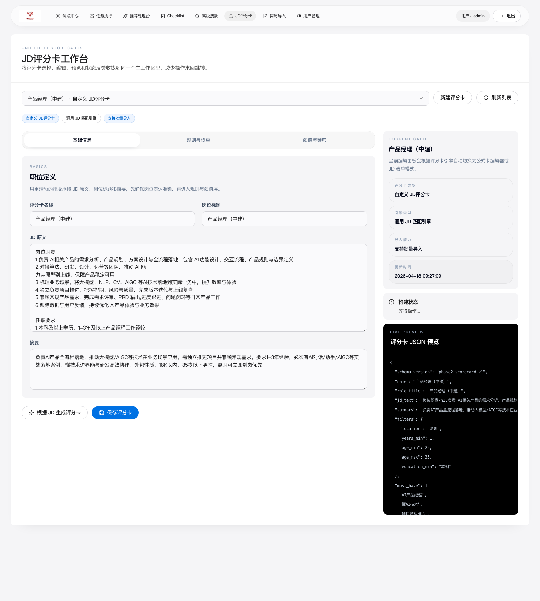
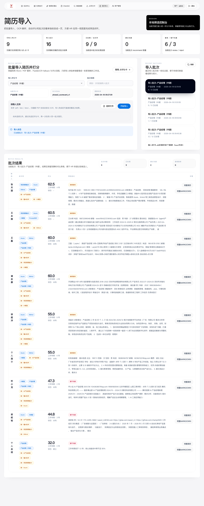
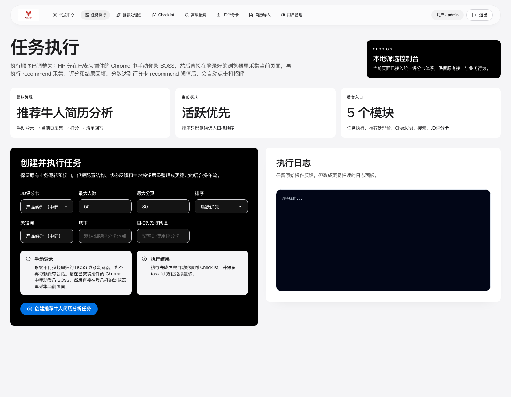
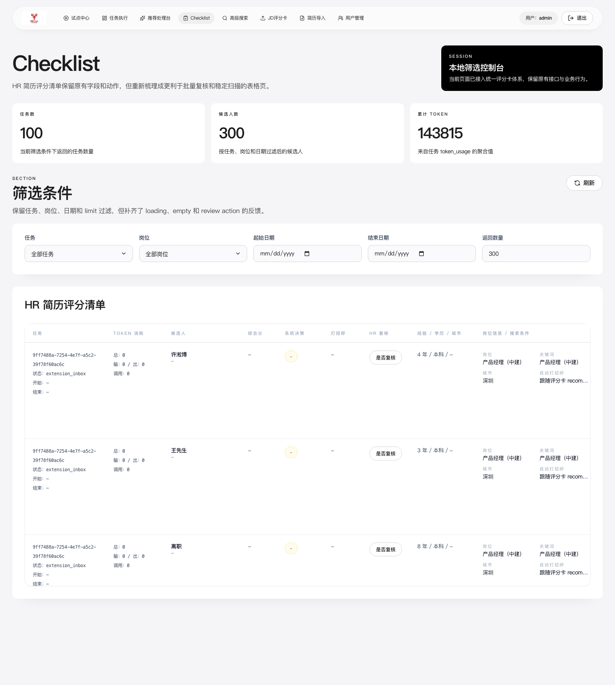
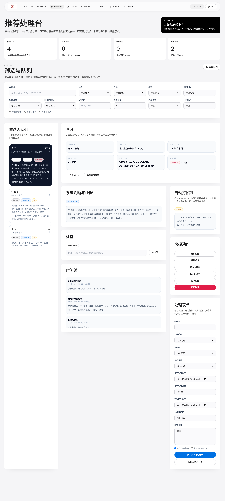
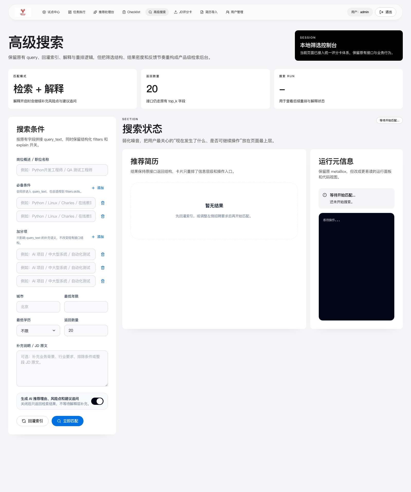
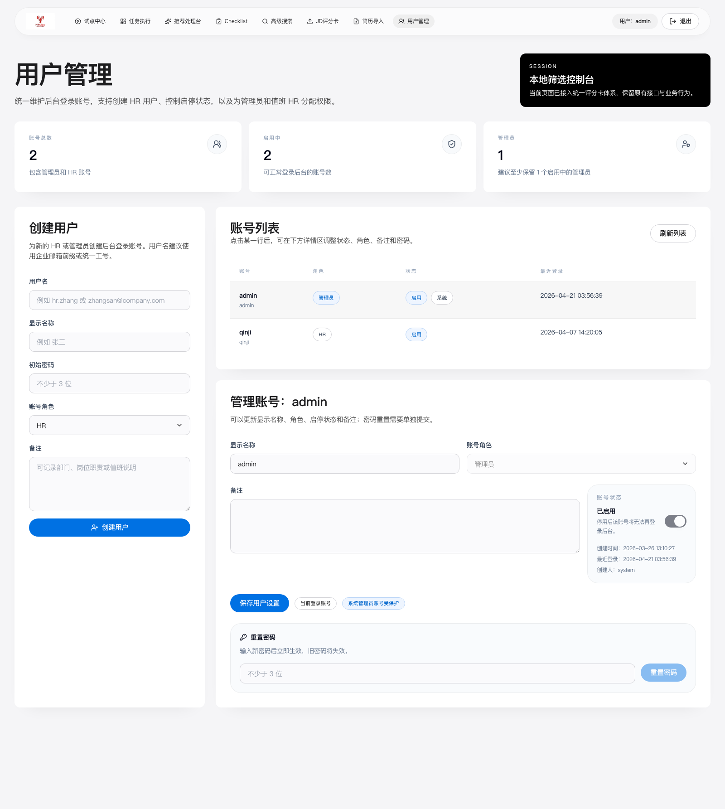

# HRClaw 客户版功能说明

> 适用场景：客户介绍、产品演示、试点沟通、售前材料  
> 版本基线：当前本地交付版本

## 1. HRClaw 是什么

HRClaw 是一套面向招聘团队的本地优先智能筛选系统，目标不是替代完整 ATS，而是先帮助 HR 团队把“岗位标准统一、简历初筛提效、浏览器候选人处理留痕”这几件最关键的事情先跑通。

它把 3 类招聘输入统一接入同一套评分后台：

- 岗位 JD
- PDF / Word 简历
- 浏览器中的候选人详情页

最终输出的是一套可执行的招聘结论，而不是只有一个分数。

## 2. 它解决什么问题

### 2.1 招聘标准不统一

同一个岗位，不同 HR、不同面试官往往理解不同。HRClaw 可以先把 JD 转成一份结构化评分卡，让筛选标准先统一下来。

### 2.2 简历初筛效率低

团队在批量看简历时，经常需要反复读 PDF、人工比较、复制沟通意见。HRClaw 支持批量导入简历、自动结构化、自动评分，并输出建议沟通、继续复核、暂不沟通三类结果。

### 2.3 浏览器工作流无法沉淀

很多团队还是在招聘网站和浏览器里看候选人，但这些动作很难沉淀成结构化结果。HRClaw 提供 Chrome 插件和任务执行页，把浏览器中的候选人详情页纳入统一后台。

## 3. 核心功能

## 3.1 试点中心

试点中心是当前版本的总入口，用于把 JD 评分卡、简历导入、任务执行三条路径统一起来。

**能做什么**

- 统一试点入口
- 明确推荐使用顺序
- 直接跳转到评分卡、简历导入和任务执行页面

## 3.2 JD 评分卡

JD 评分卡把岗位描述变成结构化筛选标准，是系统的第一步。

**能做什么**

- 粘贴岗位 JD
- 配置岗位名称、经验、筛选条件、排除项
- 维护评分权重和阈值
- 实时查看评分卡结果

**适合谁**

- HR
- 招聘负责人
- 用人经理

## 3.3 批量简历导入

简历导入页是当前版本最稳妥的使用方式，适合试点期快速验证系统价值。

**能做什么**

- 上传 PDF / DOC / DOCX 简历
- 自动抽取候选人姓名、学历、年限、关键词
- 自动打分并输出建议沟通 / 继续复核 / 暂不沟通
- 回看历史批次结果
- 查看完整简历和 Markdown 简历

## 3.4 推荐牛人简历分析

任务执行页用于在已经手工登录的 Chrome 浏览器中执行推荐流程分析。

**能做什么**

- 指定评分卡
- 设置最大人数、分页、关键词、城市
- 执行推荐页候选人分析
- 分数达到阈值后自动打招呼
- 结果回写到复核清单

## 3.5 Checklist 复核清单

Checklist 是 HR 批量复核的页面，用于把系统评分结果变成真正可执行的招聘结论。

**能做什么**

- 查看一批候选人的筛选结果
- 按任务、岗位、日期筛选
- 查看完整简历截图、Markdown、JSON 证据
- 标记是否复核

## 3.6 推荐处理台

推荐处理台用于单个候选人的深入处理和后续跟进。

**能做什么**

- 查看候选人摘要与系统建议
- 调整阶段、结论、原因和备注
- 设置最近沟通结果和下次跟进时间
- 维护标签和人才库状态

## 3.7 高级搜索

高级搜索用于在本地候选人库中按条件搜索历史候选人。

**能做什么**

- 按岗位概述、必备条件、加分项、城市、学历、年限搜索
- 回灌索引
- 生成推荐理由、风险点和追问建议

## 3.8 用户管理

用户管理面向管理员，用于维护后台账号。

**能做什么**

- 创建 HR / 管理员账号
- 控制账号启停
- 重置密码
- 查看登录时间

## 3.9 Chrome 插件采集层

Chrome 插件适合已经习惯浏览器工作流的招聘团队。

**能做什么**

- 识别当前候选人详情页
- 秒级展示 `JD 速览`
- 异步返回完整评分
- 在插件中保存候选人跟踪状态

## 4. 典型使用流程

### 4.1 最推荐的试点路径

1. 先建立一个岗位的 JD 评分卡
2. 先导入 5 份熟悉的简历验证结果
3. 再导入 20 到 50 份历史简历做校准
4. 最后再接入浏览器插件或推荐页分析流程

### 4.2 浏览器采集路径

1. HR 在 Chrome 中人工登录招聘网站
2. 打开推荐页或候选人详情页
3. 在 HRClaw 中执行任务或打开插件
4. 结果自动回到 Checklist 和推荐处理台

## 5. 当前版本价值

- 本地优先，便于试点和内网部署
- 先解决最常用的招聘初筛问题，不做过重系统
- 同一套评分引擎覆盖 JD、简历和浏览器候选人页面
- 结果不只给分，还给证据和后续处理动作

## 6. 适合怎么试点

推荐从以下方式开始：

- 1 个岗位
- 1 位 HR
- 1 位用人经理
- 20 到 50 份历史简历

优先岗位建议：

- 测试工程师
- Python 后端
- AI 应用开发工程师

## 7. 当前版本边界

- 推荐流程以人工登录浏览器后执行为主
- OCR 对扫描版简历质量敏感
- 当前版本以本地试点和内网交付为主
- 不是完整 ATS，不覆盖所有招聘流程

## 8. 相关材料

- [完整版功能说明书](HRClaw_功能说明书.md)
- [试点SOP](HRClaw_试点SOP.md)
- [部署与使用说明](中文说明书-部署与使用.md)

